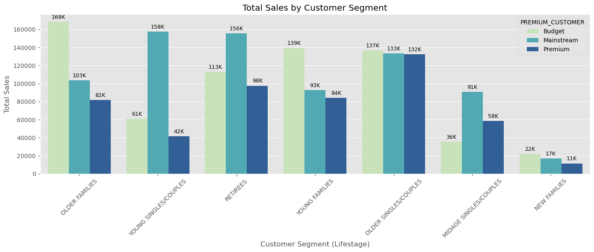

# 📦 Quantium — Chips Category Review


## Table of contents

1. [Project summary](#project-summary)  
2. [What’s included (files to upload)](#whats-included-files-to-upload)  
3. [Repository structure (recommended)](#repository-structure-recommended)  
4. [Key findings (executive highlights)](#key-findings-executive-highlights)  
5. [Strategic recommendations (summary)](#strategic-recommendations-summary)  
6. [Visuals & deliverables](#visuals--deliverables)  
7. [License](#license)  
8. [Appendix Useful code snippets](#appendix-useful-code-snippets)

---

## Project summary

This repository contains the analysis and deliverables produced for the **Chips Category Review** prepared for Julia (Category Manager). The work answers two core questions:

- **Who buys chips and how do they shop?** — segment-level behaviour, pack-size and price-point preferences.  
- **Did the new layout trial work?** — evaluation of trial stores **77, 86 and 88** against matched control stores; uplift analysis and driver diagnostics.

Deliverables include reproducible Jupyter notebooks, cleaned data exports, visual assets and a client-ready presentation.

---

## What’s included (files to upload manually)

> Place the following files in the repository as-is (or upload them via the GitHub web UI). Keep filenames unchanged to preserve notebook paths.

```

data/
├─ QVI\_transaction\_data.xlsx
├─ QVI\_purchase\_behaviour.csv
└─ cleaned\_chip\_data.csv

notebooks/
├─ Report.ipynb
├─ Retail\_Analytics.ipynb
└─ Retail\_Strategy.ipynb

outputs/
└─ trial\_analysis\_plots.pdf

```


---

## Key findings — executive highlights

- **Primary customer contributors:** *Older Families (Budget)* and *Young Singles/Couples (Mainstream)* are the dominant drivers of chips volume and sales.
- **Pack-size behaviour:** Singles/Couples tend to purchase larger pack sizes (~185g). Families purchase more units per transaction (higher quantity).
- **Price preference:** Budget and Mainstream tiers account for the majority of sales; Premium appeals mainly to older singles and retirees.
- **Trial evaluation summary (Feb–Apr 2019):**
  - **Store 77**: ~**+5.2% uplift** in sales compared to its matched control; uplift primarily driven by **increased transactions** rather than increased customer reach.
  - **Stores 86 & 88**: No statistically meaningful uplift vs matched controls.
- **Primary implication:** A targeted rollout is recommended — expand the new layout to stores whose customer and sales profile closely match Store 77; defer or re-test in stores resembling 86 and 88.

---

## Strategic recommendations (summary)

1. **Rollout strategy**
   - Pilot rollout to a cohort of stores matched to Store 77 (demographic mix, life-stage distribution, affluence).
   - Ensure matched-control measurement and at least two quarters of post-rollout monitoring before broader rollout.

2. **Merchandising & pack strategy**
   - Introduce family-value bundles and multi-save packs targeted at Older & Young Families.
   - Offer premium, single-serve or large-pack lines positioned for Singles/Couples and Retirees.

3. **Marketing & personalization**
   - Leverage loyalty and life-stage signals to target promotions and communications.
   - Run A/B tests for promotional placement, pack sizes and pricing across matched stores.

4. **Analytics & measurement**
   - Continue matched-control experiments for any future layout changes.
   - Track both reach (unique customers) and intensity (transactions per customer) to surface the driver of any sales change.

---

## Visuals & deliverables

### Total Sales by Customer Segment



---

## License

This repository is provided under the **MIT License**. See `LICENSE` in the repository root for full terms.

---


## Appendix Useful code snippets

### 0. Common imports and reproducibility

```python
import re
import numpy as np
import pandas as pd
import matplotlib.pyplot as plt
import seaborn as sns
from scipy.stats import pearsonr, ttest_ind
from scipy.spatial.distance import euclidean
import math
import json

# Reproducibility
RNG_SEED = 42
np.random.seed(RNG_SEED)

sns.set(style="whitegrid")
```

---

### 1. Read files (Excel/CSV) and quick inspect

```python
trans = pd.read_excel("data/QVI_transaction_data.xlsx")
cust  = pd.read_csv("data/QVI_purchase_behaviour.csv")

# Quick checks
print(trans.shape, cust.shape)
print(trans.head())
print(trans.info())
```

---

### 2. Robust DATE conversion (Excel serials OR strings)

```python
def to_datetime_robust(series):
    """Convert a pandas Series to datetime handling Excel serial numbers and common string formats."""
    # Fast path: if dtype is datetime already
    if np.issubdtype(series.dtype, np.datetime64):
        return pd.to_datetime(series)

    # Try numeric (Excel serial) conversion
    if pd.api.types.is_numeric_dtype(series):
        try:
            return pd.to_datetime(series, origin='1899-12-30', unit='D')
        except Exception:
            pass

    # Fallback: let pandas parse strings (coerce errors to NaT)
    return pd.to_datetime(series, errors='coerce', dayfirst=False)

trans['DATE'] = to_datetime_robust(trans['DATE'])
```

---

### 3. Basic cleaning: types, missing, numeric coercion

```python
# Drop exact duplicates
trans = trans.drop_duplicates()

# Strip whitespace from string columns
trans['PROD_NAME'] = trans['PROD_NAME'].astype(str).str.strip()

# Clean numeric TOT_SALES (in case of currency symbols / commas)
trans['TOT_SALES'] = (
    trans['TOT_SALES']
    .astype(str)
    .str.replace(r'[^\d\.-]', '', regex=True)  # remove non-numeric (like $ ,)
    .replace('', '0')
    .astype(float)
)

# Ensure PROD_QTY numeric
trans['PROD_QTY'] = pd.to_numeric(trans['PROD_QTY'], errors='coerce').fillna(0).astype(int)

# Drop rows without a date or store (essential fields)
trans = trans.dropna(subset=['DATE', 'STORE_NBR'])
```

---

### 4. Extract PACK\_SIZE (g) robustly and BRAND

```python
def extract_pack_size(prod_name):
    # Regex: captures numbers like 175g, 175 g, 175.5g, "175 gram"
    m = re.search(r'(\d+(?:\.\d+)?)\s*(?:g|gram|grams)\b', prod_name, flags=re.I)
    if m:
        return float(m.group(1))
    # fallback patterns (e.g., '2 x 85g' -> 85)
    m2 = re.search(r'(\d+)\s*[xX]\s*(\d+(?:\.\d+)?)\s*(?:g|gram|grams)\b', prod_name, flags=re.I)
    if m2:
        return float(m2.group(2))
    return np.nan

def extract_brand(prod_name):
    # Quick heuristic: first token up to first space or known separator.
    # For more accuracy provide a list of known brands and match
    brand = prod_name.split()[0].upper()
    return brand

trans['PACK_SIZE'] = trans['PROD_NAME'].astype(str).apply(extract_pack_size)
trans['BRAND'] = trans['PROD_NAME'].astype(str).apply(extract_brand)
```

---

### 5. Merge transaction and customer files safely

```python
# Ensure merge key dtype matches
cust['LYLTY_CARD_NBR'] = cust['LYLTY_CARD_NBR'].astype(str)
trans['LYLTY_CARD_NBR'] = trans['LYLTY_CARD_NBR'].astype(str)

# Left merge (keep transactions); inner if you only want linked customers
df = pd.merge(trans, cust, how='left', on='LYLTY_CARD_NBR', validate='m:1')

# Count unmatched
unmatched = df['LYLTY_CARD_NBR'].isna().sum()
print(f"Unmatched transactions (no customer record): {unmatched}")
```

---

### 6. Outlier removal (IQR method) — configurable per column

```python
def remove_outliers_iqr(df, col, factor=1.5):
    q1 = df[col].quantile(0.25)
    q3 = df[col].quantile(0.75)
    iqr = q3 - q1
    lower = q1 - factor * iqr
    upper = q3 + factor * iqr
    return df[(df[col] >= lower) & (df[col] <= upper)]

# Example: remove extreme TOT_SALES values
df_no_out = remove_outliers_iqr(df, 'TOT_SALES', factor=1.5)
```

---

### 7. Aggregate monthly store metrics (sales / customers / transactions)

```python
df['MONTH'] = df['DATE'].dt.to_period('M')
monthly_metrics = (
    df
    .groupby(['STORE_NBR', 'MONTH'])
    .agg(
        total_sales=('TOT_SALES', 'sum'),
        unique_customers=('LYLTY_CARD_NBR', 'nunique'),
        transactions=('TXN_ID', 'nunique')
    )
    .reset_index()
)
monthly_metrics['avg_txn_per_customer'] = monthly_metrics['transactions'] / monthly_metrics['unique_customers']
```

---

### 8. Control store matching (Pearson + magnitude-distance combined score)

```python
def compute_magnitude_distance(a, b):
    """Euclidean distance over aligned vectors a and b."""
    return euclidean(a, b)

def find_best_control(trial_store, metric_df, months_window=None, min_overlap=6):
    """
    For a trial_store, score every candidate store by:
      - Pearson correlation (on overlapping months)
      - Normalized magnitude distance (lower distance -> higher score)
    Returns a sorted list of (store, combined_score, corr, norm_distance).
    """
    # Subset relevant months if provided
    if months_window is not None:
        metric_df = metric_df[metric_df['MONTH'].isin(months_window)]

    # Pivot to get time series per store
    pivot = metric_df.pivot(index='MONTH', columns='STORE_NBR', values='total_sales')

    trial_series = pivot[trial_store].dropna()
    scores = []

    for candidate in pivot.columns:
        if candidate == trial_store:
            continue
        candidate_series = pivot[candidate].dropna()
        # align by intersection
        common_idx = trial_series.index.intersection(candidate_series.index)
        if len(common_idx) < min_overlap:
            continue
        a = trial_series.loc[common_idx].values
        b = candidate_series.loc[common_idx].values

        # Pearson correlation
        corr, _ = pearsonr(a, b)

        # Magnitude distance (euclidean)
        dist = compute_magnitude_distance(a, b)
        scores.append((candidate, corr, dist))

    if not scores:
        return []

    # Normalize distances to [0,1] where 1 is best (=smallest distance)
    dists = np.array([s[2] for s in scores], dtype=float)
    dmin, dmax = dists.min(), dists.max()
    norm_dist = [(1 - (d - dmin) / (dmax - dmin)) if dmax > dmin else 1.0 for d in dists]

    combined = []
    for (candidate, corr, dist), nd in zip(scores, norm_dist):
        # Combine correlation and normalized-distance equally weighted
        combined_score = 0.5 * corr + 0.5 * nd
        combined.append((candidate, combined_score, corr, nd))

    combined_sorted = sorted(combined, key=lambda x: x[1], reverse=True)
    return combined_sorted

# Example usage:
best_controls_for_77 = find_best_control(77, monthly_metrics)
print(best_controls_for_77[:5])  # top 5 candidate controls
```

---

### 9. Statistical test for uplift (paired t-test or permutation test)

```python
# Paired t-test on matched months
from scipy.stats import ttest_rel

def test_uplift(trial_store, control_store, monthly_df, trial_period):
    """
    Compare trial vs control in trial_period.
    trial_period: list-like of Periods (e.g., ['2019-02','2019-03','2019-04'])
    """
    sub = monthly_df[monthly_df['MONTH'].isin(trial_period)]
    t = sub[sub['STORE_NBR'] == trial_store].set_index('MONTH')['total_sales']
    c = sub[sub['STORE_NBR'] == control_store].set_index('MONTH')['total_sales']
    aligned = pd.concat([t, c], axis=1, join='inner').dropna()
    aligned.columns = ['trial', 'control']
    if len(aligned) < 2:
        return None
    tstat, pval = ttest_rel(aligned['trial'], aligned['control'])
    return {'t_stat': float(tstat), 'p_value': float(pval), 'n_months': len(aligned)}

# Example
trial_period = pd.period_range("2019-02", "2019-04", freq="M")
res = test_uplift(77, 42, monthly_metrics, trial_period)
print(res)
```

If data does not satisfy t-test assumptions or sample is small, consider a permutation test:

```python
def permutation_test_diff(trial_vals, control_vals, n_perm=10000):
    observed = np.mean(trial_vals - control_vals)
    concat = np.concatenate([trial_vals, control_vals])
    n = len(trial_vals)
    count = 0
    for _ in range(n_perm):
        np.random.shuffle(concat)
        new_diff = np.mean(concat[:n] - concat[n:])
        if abs(new_diff) >= abs(observed):
            count += 1
    p_value = count / n_perm
    return observed, p_value
```

---

### 10. Plotting a bar chart with K / M formatted labels

```python
def format_k_m(x):
    if x >= 1_000_000:
        return f'{x/1_000_000:.1f}M'
    elif x >= 1_000:
        return f'{x/1_000:.0f}K'
    else:
        return f'{x:.0f}'

def plot_total_sales_by_segment(df_segments, x='LIFESTAGE', y='total_sales', hue='PREMIUM_CUSTOMER', palette='YlGnBu'):
    plt.figure(figsize=(12,6))
    ax = sns.barplot(data=df_segments, x=x, y=y, hue=hue, palette=palette)
    # Add labels on bars
    for container in ax.containers:
        labels = [format_k_m(bar.get_height()) for bar in container]
        ax.bar_label(container, labels=labels, label_type='edge', padding=3, fontsize=9)
    ax.set_title('Total Sales by Customer Segment')
    plt.xticks(rotation=45)
    plt.tight_layout()
    return ax

# Usage (df_segments is pre-aggregated)
# ax = plot_total_sales_by_segment(segment_metrics)
# plt.show()
```

---

### 11. Save figures & export CSVs (reproducible outputs)

```python
def save_figure(fig, path, dpi=150):
    fig = fig if fig else plt.gcf()
    fig.savefig(path, bbox_inches='tight', dpi=dpi)

# Example: save current figure
plt.savefig('outputs/total_sales_by_segment.png', bbox_inches='tight', dpi=150)

# Export aggregated tables
monthly_metrics.to_csv('outputs/monthly_metrics.csv', index=False)
```

---

### 12. Helpful utilities — pretty printing JSON results & summary table

```python
def print_json(obj):
    print(json.dumps(obj, indent=2, default=str))

# Create a readable summary DataFrame for trial/control pairs
def trial_summary_df(trial, control, monthly_df, trial_period):
    compare = monthly_df[monthly_df['MONTH'].isin(trial_period)]
    t = compare[compare['STORE_NBR'] == trial].set_index('MONTH')['total_sales']
    c = compare[compare['STORE_NBR'] == control].set_index('MONTH')['total_sales']
    merged = pd.concat([t, c], axis=1, join='inner').dropna()
    merged.columns = ['trial_total_sales', 'control_total_sales']
    merged['pct_diff'] = (merged['trial_total_sales'] - merged['control_total_sales']) / merged['control_total_sales'] * 100
    merged = merged.reset_index()
    return merged

# Example usage:
# summary = trial_summary_df(77, 42, monthly_metrics, trial_period)
# print(summary)
```
---
